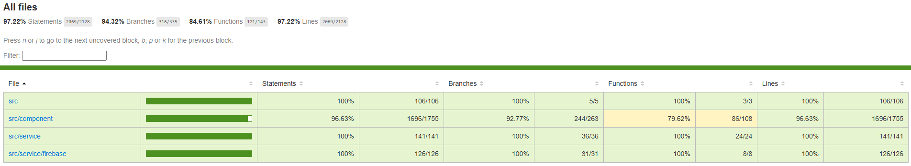

# 📦 Storage Management App

**StorageManagementApp** is a responsive web application built with React and Vite, designed to help you manage food storage. 
Always forget how much you left in the fridge like me? This app can help you keep track of it and record 
your meals. 🎉

**Backend Repository**: https://github.com/zeli8888/MyStorageManagement-API.git

---

## 📋 Table of Contents
- [✨ Features](#-features)
- [🚀 Getting Started](#-getting-started)
  - [🔧 Installation](#-installation)
  - [⚙️ Configuration](#️-configuration)
- [💻 Usage](#-usage)
- [🤝 Contributing](#-contributing)
- [📝 License](#-license)
- [📧 Contact](#-contact)

---

## ✨ Features
- **Feature 1**: Interactive Dashboard Interface 📂
- **Feature 2**: User Authentication with Firebase Authentication 🔐
- **Feature 3**: Update Ingredients Storage Automatically With New Meal Record 🔃
- **Feature 4**: Ongoing: Visualized Storage Panel, Meal Record Statics and Shopping Suggestions 📈
- **Feature 5**: Responsive Website suitable for different size of mobile phones, tablets and desktop computers 📱
- **Feature 6**: Complete Test Cases with >97% Coverage 🧑‍🔬

---

## 🚀 Getting Started

### 🔧 Installation
To get started with **StorageManagementApp**, follow these steps:

1. Clone the repository:
   ```bash
   git clone https://github.com/zeli8888/MyStorageManagement.git
   ```

2. Navigate to the project directory:
   ```bash
   cd MyStorageManagement
   ```

3. Install the dependencies:
   ```bash
   npm install
   ```

### ⚙️ Configuration
- This application use [Firebase](https://console.firebase.google.com/)
- To configure the project, please replace the following environment variables in [.env](./.env) with yours first:

    ```env
    VITE_REACT_APP_API_URL=your_api_url
    VITE_REACT_APP_CONTEXT=your_react_context
    VITE_FIREBASE_API_KEY=your_firebase_api_key
    VITE_FIREBASE_AUTH_DOMAIN=your_firebase_auth_domain
    VITE_FIREBASE_PROJECT_ID=your_firebase_project_id
    VITE_FIREBASE_STORAGE_BUCKET=your_firebase_storage_bucket
    VITE_FIREBASE_MESSAGE_SENDER_ID=your_firebase_message_sender_id
    VITE_FIREBASE_APP_ID=your_firebase_app_id
    VITE_FIREBASE_MEASUREMENT_ID=your_firebase_measurement_id
    ```

- If you use mine, you can only try it in localhost (no guarantee to work in the future), other domains are banned.
---

## 💻 Usage
Here’s how to use **StorageManagementApp**:

1. Install the dependencies:
   ```bash
   npm install
   ```

2. Run the project:
   ```bash
   npm start
   ```

3. Access the application at `http://127.0.0.1:3006`.

4. (Optional) Run the test:
    ```bash
    npm test
    ```
---

## 🤝 Contributing
We welcome contributions! 🎉 If you'd like to contribute, please follow these steps:

1. Fork the repository.

2. Create a new branch:
   ```bash
   git checkout -b feature/your-feature-name
   ```

3. Commit your changes:
   ```bash
   git commit -m "Add your awesome feature"
   ```

4. Push to the branch:
   ```bash
   git push origin feature/your-feature-name
   ```

5. Open a pull request. 🚀

---

## 📝 License
This project is licensed under the **MIT License**. See the [LICENSE](LICENSE) file for details. 🐜

---

## 📧 Contact
If you have any questions or feedback, feel free to reach out:

- **Email**: zeli8888@outlook.com 📩
- **GitHub Issues**: [Open an Issue](https://github.com/zeli8888/MyStorageManagement/issues) 🐛

---

Made with ❤️ by [Ze Li](https://github.com/zeli8888). Happy coding! 🎉